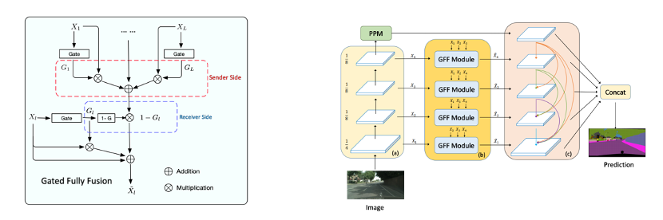

## (New) Improved Version of DecoupleSegNet for Glass-like object segmentation EBLNet-ICCV-2021 code [link](https://github.com/hehao13/EBLNet) !!

## (New)DecoupleSegNets are also verified to handle the segmentation cases where the boundaries are important for the task. We will release the related code and paper in this repo.


## (New) DecoupleSegNets are supported by the [PaddleSeg](https://github.com/PaddlePaddle/PaddleSeg) which has better results !!! Thanks for their work!!!


# DecoupleSegNets
This repo contains the the implementation of Our ECCV-2020 work: Improving Semantic Segmentation via Decoupled Body and Edge Supervision.

This is the join work of Peking University, University of Oxford and Sensetime Research. (Much thanks for Sensetimes' GPU server)


Any Suggestions/Questions/Pull Requests are welcome.

It also contains reimplementation of our previous AAAI-2020 work (oral) . 
GFFNet:Gated Fully Fusion for semantic segmentation which also achieves the state-of-the-art results on CityScapes:
  
## Decouple SegNets


## GFFNet


# DataSet preparation
Dataloaders for Cityscapes, Mapillary, Camvid ,BDD and Kitti are available in [datasets](./datasets). 
Details of preparing each dataset can be found at [PREPARE_DATASETS.md](https://github.com/lxtGH/DecoupleSegNets/blob/master/DATASETs.md)

## Requirements

pytorch >= 1.2.0
apex
opencv-python


# Model Checkpoint

## Pretrained Models

Baidu Pan Link: https://pan.baidu.com/s/1MWzpkI3PwtnEl1LSOyLrLw  4lwf

Wider-ResNet-Imagenet Link: https://drive.google.com/file/d/1dGfPvzf4fS0aaSDnw2uahQpnBrUJfRDt/view?usp=sharing

## Trained Models and CKPT

You can use these ckpts for training decouple models or doing the evaluations for saving both time and computation.

Baidu Pan Link:
link: https://pan.baidu.com/s/191joLpHxSByVKnJu8_w4_Q  password:yg4c


Google Drive:
link: https://drive.google.com/file/d/1wPF49PEdYHIvVLIAO5AsiEfc8ZmNkDY5/view?usp=sharing


# Training

To be note that, Our best models(Wider-ResNet-38) are trained on 8 V-100 GPUs with 32GB memory.
 **It is hard to reproduce such best results if you do not have such resources.**
However, our resnet-based methods including fcn, deeplabv3+, pspnet can be trained by 8-1080-TI gpus with batchsize 8.
Our training contains two steps(Here I give the ):


## 1, Train the base model.
    We found 70-80 epoch is good enough for warm up traning.
```bash
sh ./scripts/train/train_cityscapes_ResNet50_deeplab.sh
```

## 2, Re-Train with our module with lower LR using pretrained models.


### For DecoupleSegNets:
  You can use the pretrained ckpt in previous step.
  
```bash
sh ./scripts/train/train_ciytscapes_W38_decouple.

sh ./scripts/train/train_ciytscapes_ResNet50_deeplab_decouple.sh
```

# Evaluation


## 1, Single-Scale Evaluation
```bash
sh ./scripts/evaluate_val/eval_cityscapes_deeplab_r101_decouple.sh 
```

## 2, Multi-Scale Evaluation
```bash
sh ./scripts/evaluate_val/eval_cityscapes_deeplab_r101_decouple_ms.sh 
```
## 3, Evaluate F-score on Segmentation Boundary.(change the path of snapshot)
```bash
sh ./scripts/evaluate_boundary_fscore/evaluate_cityscapes_deeplabv3_r101_decouple
```

# Submission on Cityscapes

You can submit the results using our checkpoint by running 

```bash
sh ./scripts/submit_tes/submit_cityscapes_WideResNet38_decouple Your_Model_Path Model_Output_Path
```

# Demo 
Here we give some demo scripts for using our checkpoints.
You can change the scripts according to your needs.

```bash
python ./demo/demo_folder_decouple.py
```

# Citation
If you find this repo is helpful to your research Or our models are useful for your research.
Please consider cite our work.

```
@inproceedings{xiangtl_decouple
  title     = {Improving Semantic Segmentation via Decoupled Body and Edge Supervision},
  author    = {Li, Xiangtai and Li, Xia and Zhang, Li and Cheng Guangliang and Shi, Jianping and 
    Lin, Zhouchen and Tong, Yunhai and Tan, Shaohua},
  booktitle = {ECCV},
  year = {2020}
}
```

```
@inproceedings{xiangtl_gff
  title     = {GFF: Gated Fully Fusion for semantic segmentation},
  author    = {Li, Xiangtai and  Zhao Houlong and Han Lei and Tong Yunhai and Yang Kuiyuan},
  booktitle = {AAAI},
  year = {2020}
}
```

# Acknowledgement
This repo is based on NVIDIA segmentation [repo](https://github.com/NVIDIA/semantic-segmentation). 
We fully thank their open-sourced code.


# License
MIT License
